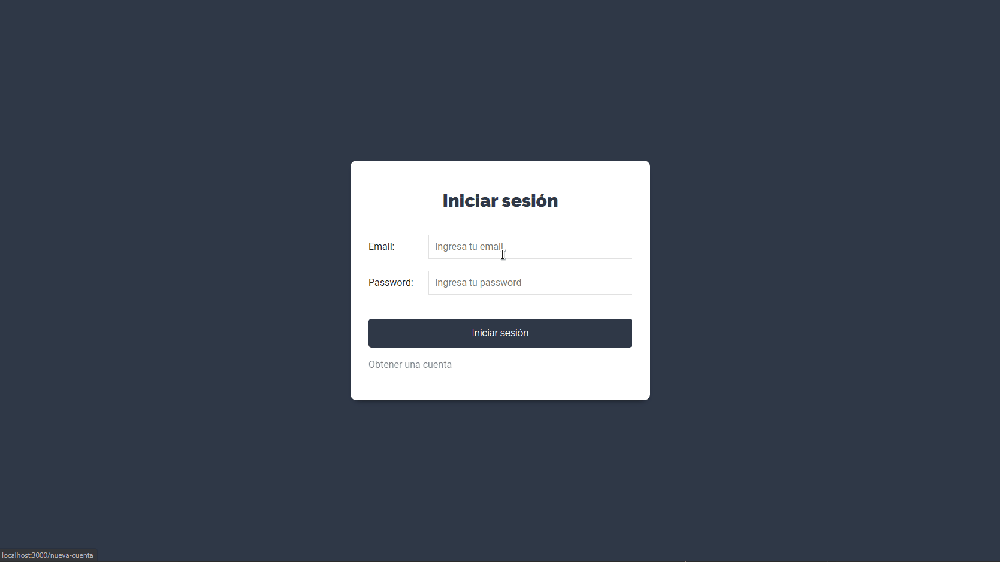

<h1 align="center">
 
MERN TASK
</h1>

Es un proyecto que se encarga de registrar poyectos y añadir tareas para luego marcar como realizadas

  

[//]: # "Add your gifs/images here:"

  

## Features

[//]: # "Add the features of your project here:"

This app features all the latest tools and practices in mobile development!

- ⚛️ **React Js** — A JavaScript library for building user interfaces
- 💹 **Node Js** — A web framework for Node Js
- 📄 **MongoDB** — A cross-platform and open-source document-oriented database
- 🔐 **JWT** — A library for authentication of users
- ♻️ **Context** — A state handler

## Getting started

**Getting started with the backend server**

1. Move yourself to the backend folder: `cd backend`
2. Create a `.env` file and add the MongoDB url connection in MONGO_URL field and SIGNATURE (can be any word)
3. Run `yarn dev` to start the server

**Getting started with the frontend app**

1. Move yourself to the frontend folder: `cd frontend`
2. Run `yarn start` to start the web application

## License

This project is licensed under the MIT License - see the [LICENSE](https://opensource.org/licenses/MIT) page for details.
